Data Visualisation ggplot2
================

The database for this analysis can be found at : <https://www.kaggle.com/footprintnetwork/ecological-footprint>

Data was originally provided by the Global Footprint Network.

``` r
library(tidyverse)
```

    ## -- Attaching packages ---------------------------------- tidyverse 1.2.1 --

    ## v ggplot2 2.2.1     v purrr   0.2.4
    ## v tibble  1.4.2     v dplyr   0.7.4
    ## v tidyr   0.8.0     v stringr 1.3.0
    ## v readr   1.1.1     v forcats 0.3.0

    ## -- Conflicts ------------------------------------- tidyverse_conflicts() --
    ## x dplyr::filter() masks stats::filter()
    ## x dplyr::lag()    masks stats::lag()

``` r
library(gridExtra)
```

    ## 
    ## Attaching package: 'gridExtra'

    ## The following object is masked from 'package:dplyr':
    ## 
    ##     combine

``` r
library(maps)
```

    ## 
    ## Attaching package: 'maps'

    ## The following object is masked from 'package:purrr':
    ## 
    ##     map

``` r
#Reading the dataset
dataset <- read_csv("ecological_footprint.csv")
```

    ## Parsed with column specification:
    ## cols(
    ##   .default = col_double(),
    ##   Country = col_character(),
    ##   Region = col_character(),
    ##   `GDP per Capita` = col_character(),
    ##   `Data Quality` = col_character()
    ## )

    ## See spec(...) for full column specifications.

Data Wrangling
==============

``` r
#Converting column names to lower case
names(dataset) <- str_to_lower(names(dataset))
#Converting " " into "_"
names(dataset) <- gsub(" ", "_",names(dataset))
#Transforming population variable name
dataset <- rename(dataset, population = `population_(millions)`)
#Removing unnecesarry variables
dataset <- dataset %>% 
  select(country,region,population,hdi,gdp_per_capita,total_ecological_footprint,total_biocapacity,biocapacity_deficit_or_reserve)

#Removing incomplete observations
dataset <- dataset %>%
  filter(population>0)
dataset <- dataset %>%
  filter(!is.na(gdp_per_capita))
dataset$gdp_per_capita <- substring(dataset$gdp_per_capita,2)
dataset$gdp_per_capita<- gsub(",", "",dataset$gdp_per_capita)
dataset$gdp_per_capita <- as.numeric(dataset$gdp_per_capita)
dataset <- dataset %>%
  filter(!is.na(hdi))
#Collapsing country regions
dataset <- dataset %>% 
  mutate(region = ifelse(grepl("European | Europe", region), "Europe", region))
dataset <- dataset %>% 
  mutate(region = ifelse(grepl("America", region), "America", region))
dataset <- dataset %>% 
  mutate(region = ifelse(grepl("Asia", region), "Asia", region))
dataset <- dataset %>%
  mutate(deficit=ifelse(biocapacity_deficit_or_reserve<0,"yes","no"))
```

Data Visualisation
==================

Histograms
----------

``` r
ggplot(data=dataset,
       aes(x=hdi)) +
  geom_histogram(bins=30)
```

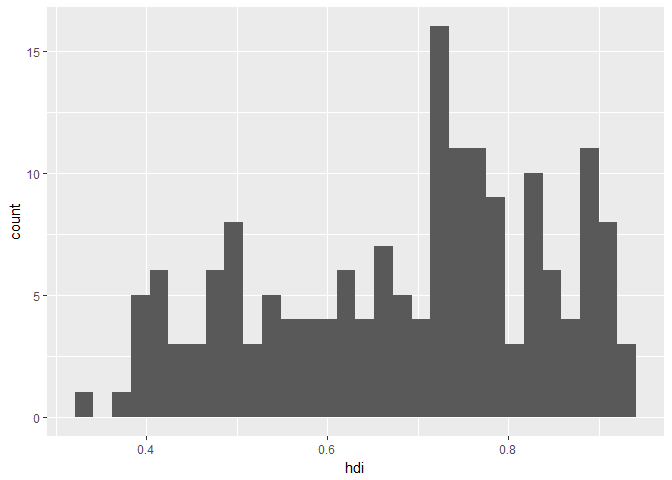

Boxplots
--------

``` r
ggplot(data=dataset, 
       aes(x=region,y=hdi)) + 
  geom_boxplot()
```

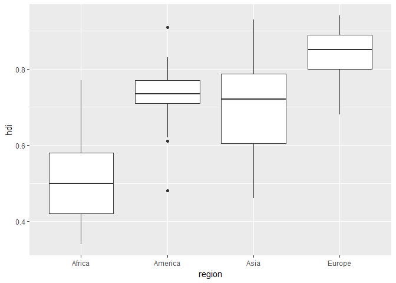

Scatterplots
------------

``` r
ggplot(data=dataset, 
       aes(x=hdi, y=total_ecological_footprint)) +
  geom_point()
```

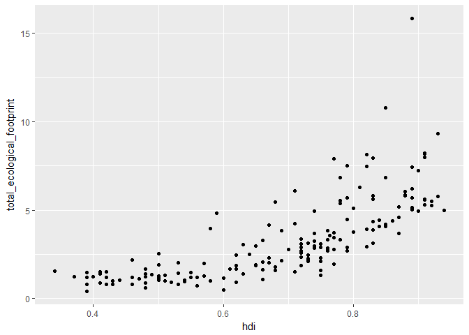

``` r
#Line fit
ggplot(data=dataset, 
       aes(x=hdi, y=total_ecological_footprint)) +
  geom_point() +
  geom_smooth(method = "lm")
```

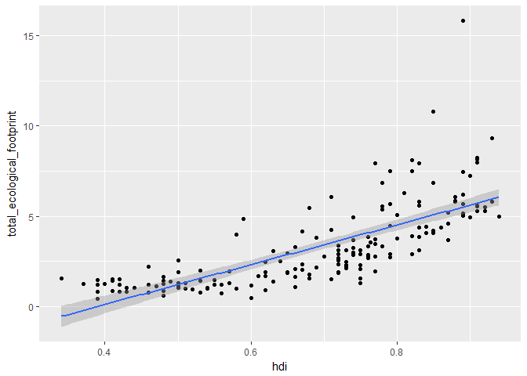

Bar graphs
----------

``` r
ggplot(data=dataset,
       aes(x=region)) +
  geom_bar()
```

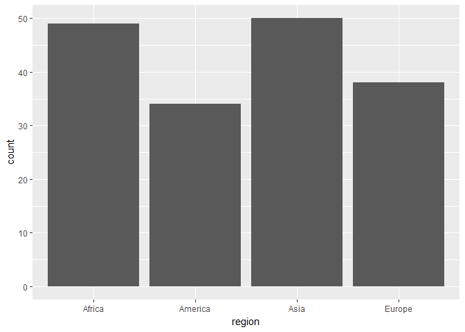

Modifiying graphs
=================

Adding color
------------

``` r
ggplot(data=dataset,
       aes(x=region, fill=region)) +
  geom_bar()
```

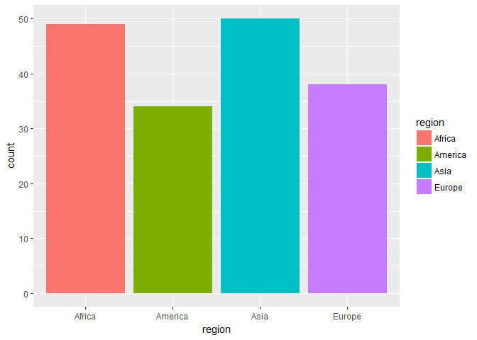

Adding a new variable
---------------------

``` r
ggplot(data=dataset,
       aes(x=region, fill=deficit)) +
  geom_bar(position = "dodge")
```

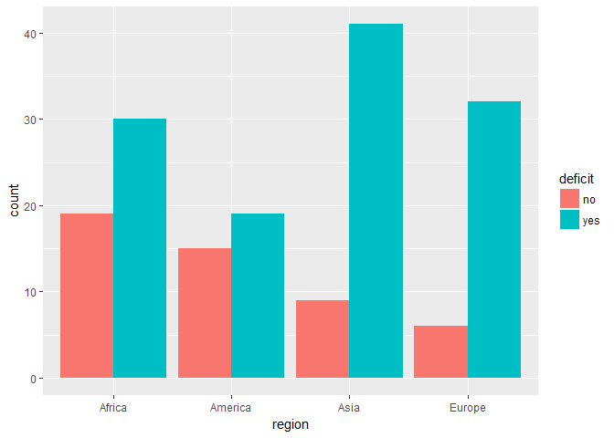

Stacked bar graphs
------------------

``` r
ggplot(data=dataset,
       aes(x=region, fill=deficit)) +
  geom_bar()
```

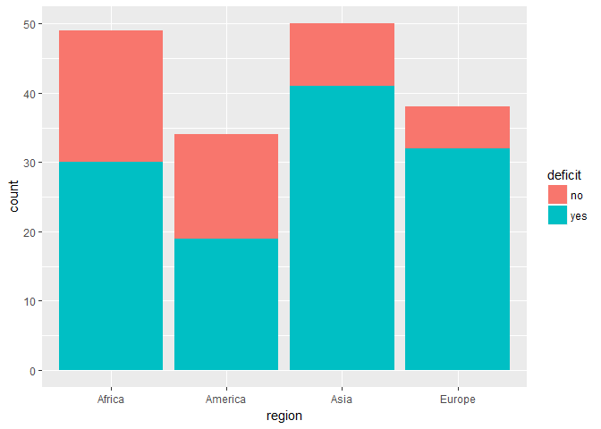

Horizontal bar
--------------

``` r
ggplot(data=dataset,
       aes(x=region, fill=region)) +
  geom_bar() + 
  coord_flip()
```

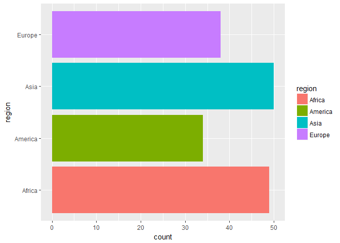

Using dplyr, top ecological footprint countries
-----------------------------------------------

``` r
dataset %>%
  group_by(country) %>%
  summarise(footmean = mean(total_ecological_footprint, na.rm=T)) %>%
  arrange(desc(footmean)) %>% 
  mutate(country = reorder(country, footmean)) %>% 
  head(10) %>% 
  ggplot(aes(x=country,y=footmean, fill=country)) +
  geom_bar(stat="identity", 
           position = "dodge") + 
  coord_flip()
```

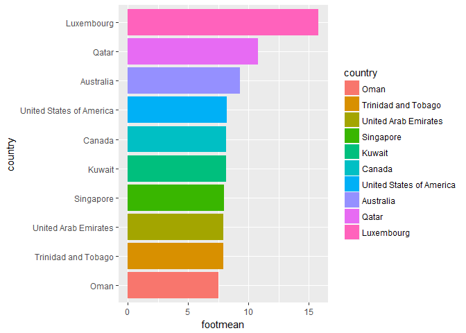

Adding contour
--------------

``` r
dataset %>%
  group_by(country) %>%
  summarise(footmean = mean(total_ecological_footprint, na.rm=T)) %>%
  arrange(desc(footmean)) %>% 
  mutate(country = reorder(country, footmean)) %>% 
  head(10) %>% 
  ggplot(aes(x=country,y=footmean, fill=country)) +
  geom_bar(stat="identity", 
           position = "dodge") + 
  coord_flip() +
  geom_col(color = "black", 
           position = "dodge")
```


Modfiying the color
-------------------

``` r
colors <- c("#95a5a6","#95a5a6","#95a5a6","#95a5a6","#95a5a6","#95a5a6","#95a5a6","#95a5a6","#95a5a6","#e74c3c")

dataset %>%
  group_by(country) %>%
  summarise(footmean = mean(total_ecological_footprint, na.rm=T)) %>%
  arrange(desc(footmean)) %>% 
  mutate(country = reorder(country, footmean)) %>% 
  head(10) %>% 
  ggplot(aes(x=country,y=footmean, fill=country)) +
  geom_bar(stat="identity", 
           position = "dodge") + 
  coord_flip() +
  geom_col(color = "black", 
           position = "dodge") +
  scale_fill_manual(values = c(colors))
```

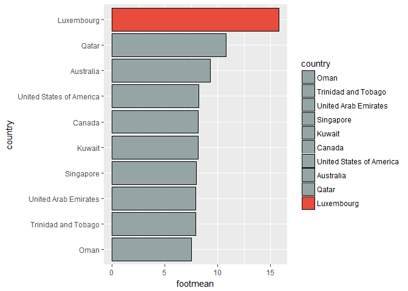

Adding a title
--------------

``` r
dataset %>%
  group_by(country) %>%
  summarise(footmean = mean(total_ecological_footprint, na.rm=T)) %>%
  arrange(desc(footmean)) %>% 
  mutate(country = reorder(country, footmean)) %>% 
  head(10) %>% 
  ggplot(aes(x=country,y=footmean, fill=country)) +
  geom_bar(stat="identity", 
           position = "dodge") + 
  coord_flip() +
  geom_col(color = "black", 
           position = "dodge") +
  scale_fill_manual(values = c(colors)) + 
  labs(x="Country", 
       y ="Ecological footprint") +
  ggtitle("Top 10 countries")
```

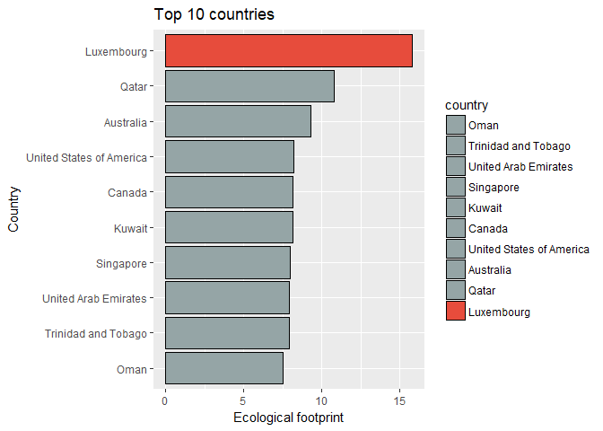

Adding a theme
--------------

``` r
dataset %>%
  group_by(country) %>%
  summarise(footmean = mean(total_ecological_footprint, na.rm=T)) %>%
  arrange(desc(footmean)) %>% 
  mutate(country = reorder(country, footmean)) %>% 
  head(10) %>% 
  ggplot(aes(x=country,y=footmean, fill=country)) +
  geom_bar(stat="identity", 
           position = "dodge") + 
  coord_flip() +
  geom_col(color = "black", 
           position = "dodge") +
  scale_fill_manual(values = c(colors)) + 
  labs(x="Country", 
       y ="Ecological footprint") +
  ggtitle("Top 10 countries") +
  theme_dark()
```

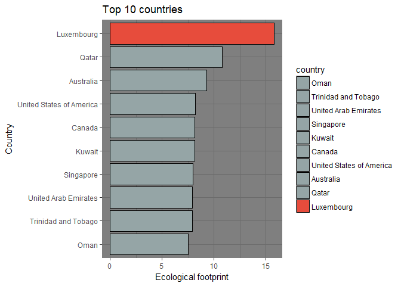

Splitting graphs
----------------

``` r
ggplot(data=dataset,
       aes(x=region, fill=deficit)) +
  geom_bar()
```


``` r
ggplot(data=dataset,
       aes(x=region, fill=deficit)) +
  geom_bar()+
  facet_wrap(c("deficit"))
```

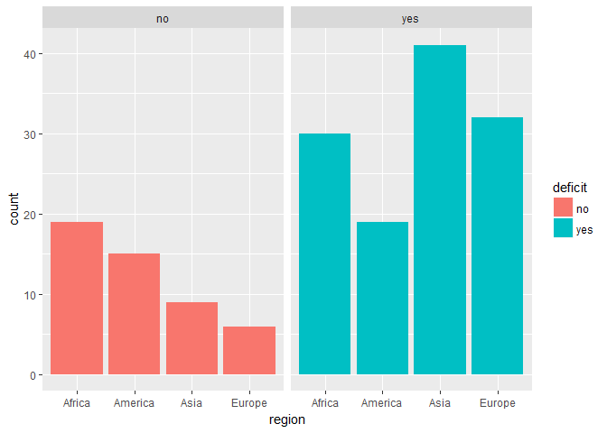

Plotting two graps
------------------

``` r
#Storing the graphs
bar_graph <- ggplot(data=dataset,
       aes(x=region, fill=region)) +
  geom_bar()
box_graph <- ggplot(data=dataset, 
                    aes(x=region,y=hdi,fill=region)) + 
  geom_boxplot()
#Creating the grid and plotting the graohs
grid.arrange(bar_graph, box_graph, ncol=2)
```

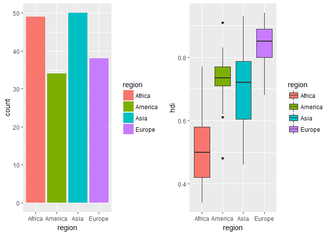

Maps
====

``` r
#Getting the worldmap
data_map <- map_data("world")
#Merging the dataset
data_map <- rename(data_map, country = region)
datasetmap <- data_map %>%
  left_join(dataset, by="country")
```

Plotting the map
----------------

``` r
ggplot(data=datasetmap, aes(x=long, y=lat, group=group, fill=total_ecological_footprint)) +  
  geom_polygon()
```

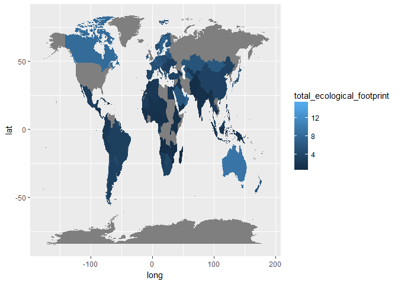

``` r
#Some country names need to be renamed since names doesn't match between databases, (note: some countries still need to be renamed)
dataset$country <- ifelse(dataset$country =="Russian Federation", "Russia",dataset$country)
dataset$country <- ifelse(dataset$country =="United States of America", "USA",dataset$country)
dataset$country <- ifelse(dataset$country =="United Kingdom", "UK",dataset$country)

#Merging again
datasetmap <- data_map %>%
  left_join(dataset, by="country")
```

Plotting the map
----------------

``` r
ggplot(data=datasetmap, 
               aes(x=long, y=lat, group=group, fill=total_ecological_footprint)) +  
  geom_polygon(color = "white") + 
  scale_fill_distiller(name="Global hectares",
                       palette = "YlOrRd",
                       direction = 1) +
  labs(title="Ecological footprint in the World")
```

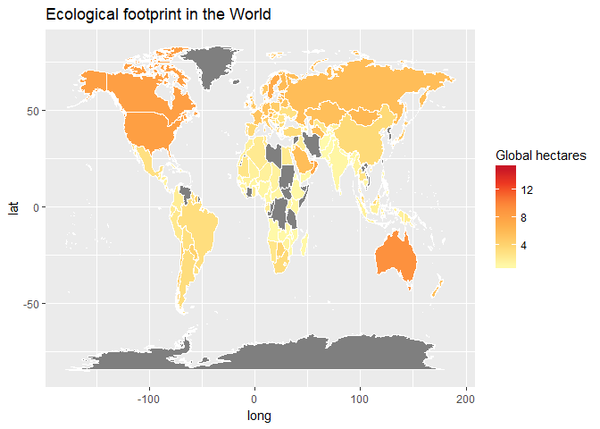
